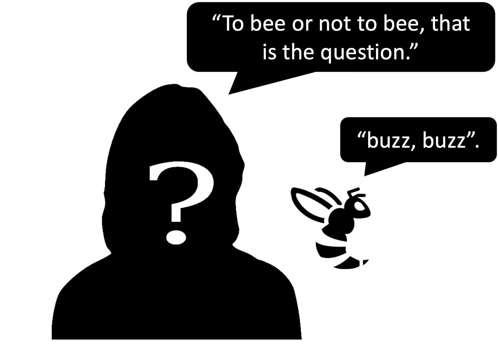
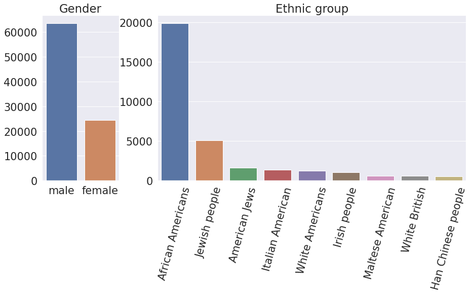
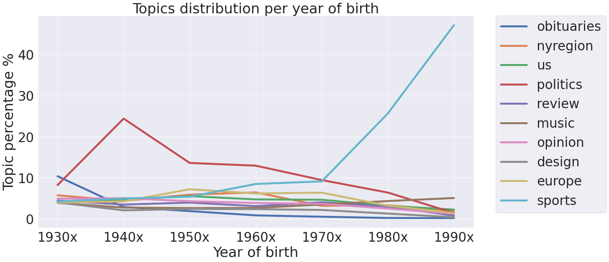
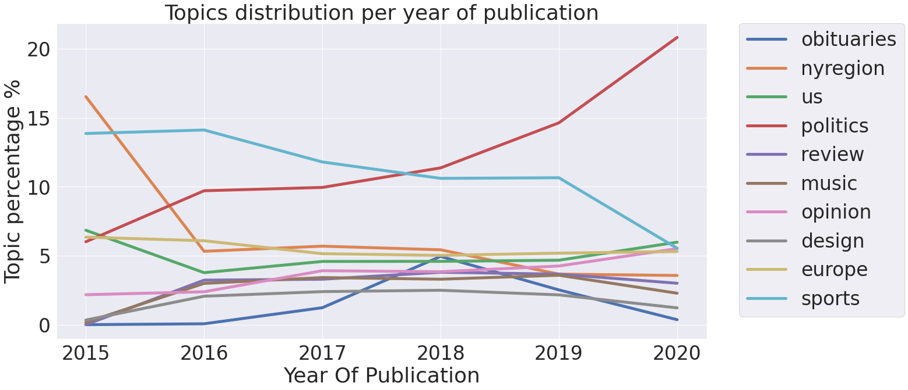

<style>
table {
margin: auto;
}
</style>


<style>
td {
  font-size: 18px;
  margin: auto;
}
</style>


## Introduction

Quotations, the repetition of well-known statement parts, have preserved and inherited wisdoms and perspectives 
that significantly changed the world. We not only focus on the power of the words but also people who speak 
them. There are lots of famous quotations that we can instantly identify the speakers. However, we can find a large 
number of quotations whose speakers are unidentifiable. We may never know their names, but is that possible to find 
other details about their profiles? 

{: .mx-auto.d-block :}
<!--  -->

Our project, **DescribeByQuote**, aims to detect the profiles of speakers from quotations based on deep learning
methods. While performing analysis of Quotebank data we found out that around **34%** of quotations do not have assigned 
speakers to it (e.g., 1.8 million out of 5.2 million in file quotes-2020.json). Our goal is to answer the following question: if we cannot determine the exact author of a quotation, what other information can we get from it? We would like to achieve this by training deep learning models that can predict different features of the person.

In this work, first we need to generate labels for our quotations which requires extra information. Therefore, we extracted additional information about known authors of the quotations by parsing their information from **Wikipedia**. Through filtering and parsing, we successfully extracted six important features of the speakers as the labels for the data, including ```Gender, Occupation, Nationality, Ethic group, Date of birth, and Religion```. 

With the data and labels, we trained six models that predicte the features of the quotations that are not assigned to speakers in Quotebank. Our method showed to ability to describe the person by using only its quotation. Also, we did analysis on the outcomes and explored the relationships between different features, as well as tried to understand the mechanism of the prediction. 

## Data

### Description

The dataset provided to us is composed of six data files. Each of them contains quotation data for one year from 2015 to 2020. In this dataset, we had the following fields: ``` quotation text, most probable author of the quote, date of publishing quotation, probabilities of quotation authors, links to the quotation source ```

Additionally, we were provided with the parquet dataset, with data scraped from Wikipedia, containing these encoded fields: ``` date of birth, nationality, gender, ethnic_group, occupation, party, academic_degree, id, candidacy, religion ```

To decode fields in the QuoteBank dataset we used descriptions matched by key values. Descriptions consist of field names and short descriptions.

### Preparation

We started our data preparation with matching the quotation dataset and data from Wikipedia. After, we decoded all fields from shortcuts to the full names. In the final dataset, there were people with popular names, for such people there were different pages on Wikipedia. For such cases it was impossible to determine the correct values of person's parameters. Therefore, we decided to exclude such cases from our dataset and removed all these people with their quotes. Thus, we were able to unambiguously correlate the values of features with people.

We wrote our data in the parquet format having short read/write time, ability to read dataset consisting of data scattered through multiple files and reading cartain columns or rows which meets desired conditions. Also, it has a possibility to connect the dataset to big data engines, e.g. Spark.

Therefore, parsing batch by batch we obtained a new dataset which contains 214M rows saved in parquet data type.

### Data analysis

Our main dataset contains two types of quotes: with a known author and an unknown one. Our goal is to predict labels for unknown authors of quotes, to this aim we split data of known authers into train, validation and test sets. Also, we hold out all unknown authers in one separate set to use them for the final predictions.

To choose only labels which might be applicable to all people we exclude ```party, academic_degree, candidacy``` labels. In the result, we keep only ```date of birth, nationality, gender, ethnic group, religion and occupation```.

To simplify our tasks, and obtain better model predictions, in each feature we take the few most popular classes as seen in the table below.

<table>
<tr>
        <td><b>Feature Name</b></td>
        <td>Gender</td>
        <td>Occupation</td>
        <td>Nationality</td>
        <td>Ethnic Group</td>
        <td>Date of Birth</td>
        <td>Religion</td>
    </tr>
    <tr>
        <td><b>Number of classes</b></td>
        <td>2</td>
        <td>10</td>
        <td>5</td>
        <td>10</td>
        <td>8</td>
        <td>10</td>
    </tr>
</table>

```date of birth``` which is continuous variable we discretized into new classes in decade sized buckets from 1930s to 1990s and having one more class for others.

For ```occupation``` we merged jobs in the same field. For example, we merged baseball player, hockey player and others into new class sportsman. 

We merged ```nationality``` by continents into five classes. In other labels we took nine most popular classes and other examples we put in "other" bin.

### Dealing with class imbalance

 


It seen from the plots that our labels are very imbalanced (here we show only two examples but all the labels are imbalanced). It might lead to biased prediction towards the most popular class. To overcome this issue, we downsample the major classes.

## Deep Learning Model

 
Our main goal is to predict features based on the quotations. For this purpose we needed to choose a language model that perform well for the classification problem and at the same time does not require a lot of computational resourses. Moreover, the task of classifying quotations is a quite complex that requires a global understanding of the text from the model. 
  
One of the models that are capabale for this task is BERT. It is an open source machine learning framework for natural language processing (NLP). It is designed to help computers understand the meaning of ambiguous language in text by using surrounding text to establish context. The BERT framework was pre-trained using text from Wikipedia and can be fine-tuned with question and answer datasets. DistilBERT is a small, fast, cheap and light transformer model based on the BERT architecture. It has about half the total number of parameters of BERT base and retains 95% of BERT’s performances on the language understanding benchmark GLUE. Thus, we choose the pretrained DistilBERT model for our predictions.
  
To use DistilBERT model for the classification task we collected text embeddings from the zeroth output and add a classification head. The output of the final model is a probability vector with the size equal to the amount of classes.

## Experiments

We trained six models with the same architecture to predict six different features. For each feature we used a separate dataset which consistes of 3 columns: ``` qouteID, quotation, feature_name```. Each dataset was split into train, validation and test sets. The plots show the training history of model for ``` date_of_birth``` prediction.
 
We can see that both train and test losses go down as well as accuracy goes up until the seventh epoch. Then test loss and accuracy become stable. It means that seven epochs is enough for the training process and after it network starts overfitting. 


## Results and Analytics

After the experiment with the six datasets (i.e., quotations labelled with ```Gender, Occupation, Nationality, Ethic group, Date of birth, and Religion```), we recorded the train and test accuracies, and also generated ROC curves and Confusion Matrices for the further analysis. Below are the table of the accuracies for each feature:

<table>
<tr>
        <td><b>Feature Name</b></td>
        <td>Gender</td>
        <td>Occupation</td>
        <td>Nationality</td>
        <td>Ethnic Group</td>
        <td>Date of Birth</td>
        <td>Religion</td>
    </tr>
    <tr>
        <td><b>Class Num</b></td>
        <td>2</td>
        <td>10</td>
        <td>5</td>
        <td>10</td>
        <td>8</td>
        <td>10</td>
    </tr>
    <tr>
        <td><b>Accuracy</b></td>
        <td>62.78%</td>
        <td>30.97%</td>
        <td>46.45%</td>
        <td>33.33%</td>
        <td>22.10%</td>
        <td>22.52%</td>
    </tr>
</table>

Below are the Confusion Matrix and ROC-AUC curves of testing with ```Ethnic Group```:

The **color** of the right side colum represents the **number of samples**
{: .mx-auto.d-block :}


During the analysis, we found some very interesting phenomenon. As we can see from the confusion matrix and ROC curves, the **Gujarati people** and **Italian Argentines** get the highest true positive rate and accuracy. However, the sample numbers of them are not as much as **African Americans**. Why is it easier for the model to identify **Gujarati people** and **Italian Argentines** with less samples for training?

Below are the confusion matrix and ROC curves of testing with ```Date of Birth```:

{: .mx-auto.d-block :}

As we can see from ROC curves and confusion matrix, quotations of the people born in 1990s gets the highest true positive rate and accuracy. Also, as shown in the 7th rows of the Matrix, most of people born in 1980s are identified as 1990s. Why does our model more likely recognize 1990s people's quotations as from other people?

In the next sections, we answer these questions by analysing reletions between different features.

## Data insights

During evaluation our model we noticed that some classes are detected better than others. This fact prompted us to delve deeper into search of insights what most likely help our models to classify the desired class.

We assumed that the same groups of people prefer similar topics for conversation, which may encourage our model to classify quotes into the classes we need. But to test this hypothesis, we need to understand the context of the quote. We noticed that in 2019, the source of 83% of citations is the New York Times. In the remaining years, NY also occupies a leading position in the list of sources of quotations. The peculiarity of NY is that there is a topic in the link to the quote, to which NY equated this quote. This fact helped us to find out the context of most of the quotes.

### Data preparation

For every feature as gender, occupation, etc. we selected quotes with New York Times source. For every quote we extracted a topic from quote links and (because sometimes links don't fit the format we expect ) we dropped all topics with total amount less than 400.
As a result for every feature we collected dataset with quote topics.

### Data analysis

#### Gender

We found out that our model distinguishes both men and women with the same accuracy. For further analysis, we decided to draw a distribution of topics for each gender.

**Remark** : we make our plots interactive. For more information, please hover the cursor over the part you are interested in.

<div class="row align-items-center no-gutters  mb-4 mb-lg-5">
  <div class="col-sm">
    <iframe src="plots/distribution_plots/gender/gender_female.html" height=410 width=445  frameborder="0" scrolling="no"> </iframe>
    <iframe src="plots/distribution_plots/gender/gender_male.html"  height=410 width=445  frameborder="0" scrolling="no"> </iframe>
  </div>
</div>

Despite the politics, women are mostly speak about review and style topics. On the other hand men are more cited in areas of sport and Europe. This may lead to a conclusion that different special word help our model to predict better. We assume especially for sports and style that they have special topics which differ from others and therefore it might be the main factor allowing our model to distinguish between these two classes.

#### Date of birth
<div class="row align-items-center no-gutters  mb-4 mb-lg-5">
  <div class="col-sm">
    <iframe src="plots/distribution_plots/years/date_of_birth_1990x.html" height=410 width=445 frameborder="0" scrolling="no"> </iframe>
    <iframe src="plots/distribution_plots/years/date_of_birth_other.html" height=410 width=445 frameborder="0" scrolling="no"> </iframe>
  </div>
</div>

Plotting topics mentioned by people born in 1990s (which authors of this site belong to) and others give us intersting insights about what people in their 20s talk the most. 

From topic distribution we see that these people are not interested in politics, situation in Europe, the USA or local region. They are more into sports, music, olympic and style.
This might be also due to fact that to enter politics you need time and experience. Also, for example, average age of senators in the USA congress is 61, thus we see that there is no much place for young people in politics.
On the other hand, peak performance of sportmen is in their 20s and 30s and it is understable that this is the topic where they are the most respected.

<div class="row align-items-center no-gutters  mb-4 mb-lg-5">
  <div class="col-sm">
     
  </div>
</div>
Topics distribution per year supports our conclusion about differences of topics in regard to year of birth. 
Interesting anomalies are big peak in politics for people born in 1940s and smaller values but still distinguishable for people  born in 50s and 60s.
From further analysis we discovered that peak in 40s is made by Donald Trump which was mostly cited in our dataset. 
Other values for politics in 50s and 60s just supports fact that most politicians in the USA are around 60 years old. 

A little bit different observation is amount of obituaries for people born in 1930s. These people at the time of publishing the quotes are between 75 and 90 years old. Although, life expentancy is a little bit less then that, we think that popularity is caused by fact that these people are still almost as popular in politics as people born in 70s. 
And for politicians when they are active publically it is more probable to by cited by newspapers than normal ones.

#### Ethnic group
<div class="row align-items-center no-gutters  mb-4 mb-lg-5">
  <div class="col-sm">
    <iframe src="plots/distribution_plots/ethnic_group/ethnic_group_Gujarati people.html" height=410 width=445 frameborder="0" scrolling="no"> </iframe>
    <iframe src="plots/distribution_plots/ethnic_group/ethnic_group_Italian Argentines.html" height=410 width=445 frameborder="0" scrolling="no"> </iframe>
    <iframe src="plots/distribution_plots/ethnic_group/ethnic_group_other.html" height=410 width=890 frameborder="0" scrolling="no"> </iframe>
  </div>
</div>

**Gujarati** people talk mostly about Asia and not that much about other topics. In this quotes, there are many distinguishable names such as names of the people or cities. This might be the clue why our model predicts them better than others.

Contrarily, the **Italian Argentines** talk mostly about Europe, which is not that different than topics in which other ethincs groups talk. In this case, there might be other factors that has more strong influence to the predictions.

#### Year of publication

We were also interested to know how the topic percentage was developing over the years.

<div class="row align-items-center no-gutters  mb-4 mb-lg-5">
  <div class="col-sm">
     
  </div>
</div>

From the plot, we see that from 2017 the newspapers started to publish more news on the topic of politics. It started alongside time when Donald Trump became the president of the USA. From the information that he is one of the most popular speaker in our dataset, we conclude that he started to publish a lot of information in newspapers which became viral.

## Conclusion


In this project, we studied the quotaitons from ```QuoteBank``` with additional data from **Wikipedia**, and built up a deep learning pipeline to predict the profile of the speakers. To our expectation, it is very difficult to predict one's profile based on only several speaking words. However, as is shown in the results, our pipeline achieves good performance on some classes of the features (e.g., people born in **1990s** in ```Date of Birth```, **Gujarati people** and **Italian Argentines** in ```Ethnic Groups```, the rest is in the **Post Page** below). Also we kept investigated the relations of the different features, such as ```Date of Birth```, ```Ethnic Group``` and ```Topics```, and we found some really interesting outcomes that certain features would share the same quotations. This could explain why our deep learning model would work like above. And, of course, this project can be expanded more such as adding more features for analysis, or do more experiments to optimize the models. We leave this for the future work.


## Reference

[BERT: Pre-training of Deep Bidirectional Transformers for Language Understanding](https://arxiv.org/abs/1810.04805)

[DistilBERT, a distilled version of BERT: smaller, faster, cheaper and lighter](https://arxiv.org/abs/1910.01108)

[Quotebank: A Corpus of Quotations from a Decade of News](https://dl.acm.org/doi/10.1145/3437963.3441760)
